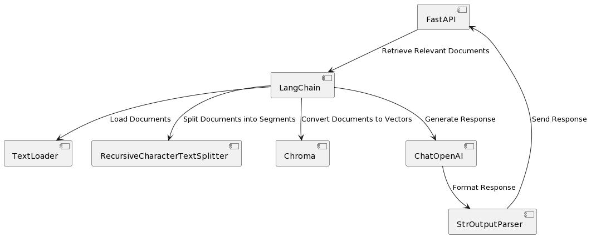

# RAG Chatbot 🦜️🔗 🦜️🏓 

## Description

The RAG Chatbot is an application that utilizes the RAG (Retrieval-Augmented Generation) architecture to provide responses to user queries. The RAG architecture enhances the capabilities of large language models (LLMs) by augmenting their knowledge with additional contextual data.

This chatbot is implemented using FastAPI, a modern web framework for building APIs with Python. It leverages the LangChain library, which provides tools and utilities for natural language processing tasks. Specifically, it uses LangChain's Runnable interfaces to orchestrate the RAG architecture.

The main components of the application include:

- **FastAPI Server**: The application is served using FastAPI, providing a robust and efficient web server.
- **LangChain Integration**: Utilizes LangChain's modules for text processing, including document loading, text splitting, and vectorization.
- **RAG Architecture**: Implements the RAG architecture to enhance the chatbot's responses by incorporating contextual information.
- **ChatOpenAI Integration**: Incorporates OpenAI's GPT-3.5-turbo model for generating responses based on the retrieved information.

The application exposes an API endpoint ("/chatbot/playground") where users can interact with the chatbot. Upon receiving a query, the chatbot retrieves relevant information from the provided documents using the RAG architecture and generates a response using the ChatOpenAI model. It's important to note that this functionality is enabled by using LangServe, a service that facilitates interactions with LangChain components.

## Component Diagram

The following diagram illustrates the main components of the RAG Chatbot application:



## Getting Started

To run the RAG Chatbot locally, follow these steps:

1. Ensure you have Python installed on your system.
2. Clone this repository to your local machine.
3. Install the required dependencies listed in `requirements.txt`.
4. Create a `.env` file and configure any necessary environment variables.
5. Navigate to the `src` directory in your terminal (`cd src`) and then run the application using `uvicorn app:chatbot`.

### Documents

Make sure to update the path or method of loading documents accordingly in the code. For example, you can specify the path to your documents on your local machine. Avoid uploading sensitive documents to the repository.

```python
loader = TextLoader("path/to/your/documents")
```

## Deployment

The RAG Chatbot can be deployed to various platforms, including cloud services like AWS, Google Cloud, and Azure. Below is an example of deploying the application to Azure, which I used to deploy my chatbot.

1. **Create Azure Container Registry**: <https://azure.microsoft.com/en-us/products/container-registry>.

2. **Build Docker Image**: Build a Docker image containing your chatbot application.

    ```bash
    docker build -t <container-registry-name>.azurecr.io/<container-name>:build-tag-1 .
    ```

3. **Push Image to Azure Container Registry**: Push the Docker image to your Azure Container Registry.

    ```bash
    docker push <container-registry-name>.azurecr.io/<container-name>:build-tag-1
    ```

4. **Create Azure Container Instance**: Use Azure Container Instances (ACI) to deploy your chatbot. Specify the image from your Azure Container Registry (<https://azure.microsoft.com/en-us/products/container-instances>).

5. **Access Your Chatbot**: Once deployed, your chatbot should be accessible using the public IP address or domain provided by Azure. Test the chatbot to ensure it's running correctly.
